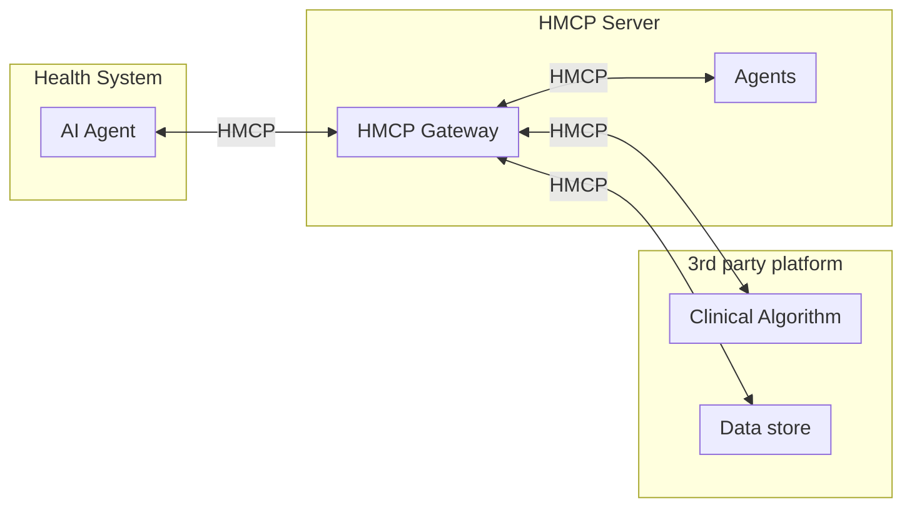

# HMCP Specification

Healthcare Model Context Protocol (HMCP) expands on base [MCP](https://modelcontextprotocol.io/specification/2025-03-26) by adding the below enhancements:

- [Authentication \& Scopes](#authentication--scopes)
- [Guardrails](#guardrails)
- [Patient Context](#patient-context)
- [Bi-directional agent to agent communication](#bi-directional-agent-to-agent-communication)
 

## Authentication & Scopes
HMCP implements OAuth 2.0 and OpenID Connect following the SMART on FHIR authorization framework model. This approach provides a standardized, secure method for healthcare applications to authenticate and obtain appropriately scoped access to clinical data.

Two primary authentication mechanisms are supported:

1. **OAuth 2.0 for user-mediated contexts** - When end-user consent and context is needed
2. **mTLS (Mutual TLS)** - For secure service-to-service communication

For detailed implementation examples and flows, see the [Authentication Implementation Guide](./auth.md).

### [Comparison of MCP vs HMCP Authentication](./hmcp_auth_vs_mcp_auth.md)

## Guardrails

Guardrails are an important differentiator of the HMCP protocol. We define guardrails as part of the `experimental` capabilities of client and server. You can configure the exact guardrail which needs to be executed for each input/output of the server agent.

[Guardrails](./guardrails.md)

## Patient Context

HMCP implements patient context sharing based on SMART on FHIR specifications, ensuring healthcare AI agents maintain proper patient context isolation and security. 

[Patient Context Sharing](./context.md)

## Bi-directional agent to agent communication

Agent to agent bidirectional communication is implemented by adding [sampling](https://modelcontextprotocol.io/specification/2025-03-26/client/sampling) capability to the HMCP server. The base MCP implementation already has sampling implemented on the client. That way HMCP client and server both can communicate using LLM inputs and output.

[Sampling](./sampling.md)

## Architecture Components

### Diagram

